# Bulk VS Creation Flow Chart

This document shows the execution flow for [bulk_vs_creation_v0.0.2.py](./bulk_vs_creation_v0.0.2.py).

If your documentation platform supports Mermaid, the diagram below will render directly.

```mermaid
flowchart TD
    A[Start] --> B[Parse CLI arguments]

    B --> C{--generate-sample-csv?}
    C -->|Yes| D{Any other args also passed?}
    D -->|Yes| E[Print error and exit]
    D -->|No| F[Generate sample CSV]
    F --> G[Exit]

    C -->|No| H[Setup logger]
    H --> I[Prompt for missing controller or username or password]
    I --> J{CSV argument present?}
    J -->|No| K[Log error and exit]
    J -->|Yes| L[Connect to Avi Controller]

    L --> M[Fetch cloud map]
    M --> N[Fetch networks]
    N --> O{CSV file exists?}
    O -->|No| P[Log error and exit]
    O -->|Yes| Q[Read CSV rows]

    Q --> R[For each CSV row]
    R --> S[Resolve VS name, Pool name, Cloud, VSVIP name]
    S --> T{Cloud found?}
    T -->|No| U[Log error and skip row]
    T -->|Yes| V[Create Pool]

    V --> W{Pool already exists?}
    W -->|Yes| X[Skip Pool creation]
    W -->|No| Y[Build pool payload]

    Y --> Z{Health monitor provided?}
    Z -->|Yes| AA[Add health_monitor_refs]
    Z -->|No| AB[Continue]
    AA --> AB

    AB --> AC{App profile is System-Secure-HTTP?}
    AC -->|Yes| AD[Add pool SSL profile]
    AC -->|No| AE[Continue]
    AD --> AE

    AE --> AF{Pool network provided?}
    AF -->|Yes| AG[Fetch network details]
    AF -->|No| AH[Continue]
    AG --> AI{Network details found?}
    AI -->|Yes| AJ[Add placement network to Pool]
    AI -->|No| AK[Log warning]
    AJ --> AL
    AH --> AL
    AK --> AL

    AL --> AM{Dry run?}
    AM -->|Yes| AN[Log would-create Pool]
    AM -->|No| AO[POST Pool]
    AO --> AP{Pool create success?}
    AP -->|Yes| AQ[Continue]
    AP -->|No| AR[Log error and skip row]
    X --> AQ
    AN --> AQ

    AQ --> AS[Create VS]
    AS --> AT{VS already exists?}
    AT -->|Yes| AU[Skip VS creation]
    AT -->|No| AV[Build VS payload]

    AV --> AW[Apply app profile, SSL profile, certificate, service port]
    AW --> AX{SE group provided?}
    AX -->|Yes| AY[Add se_group_ref]
    AX -->|No| AZ[Continue]
    AY --> AZ

    AZ --> BA{Cloud is Default-Cloud?}
    BA -->|No| BB[Create or reuse VSVIP]
    BA -->|Yes| BC[Build inline VIP block]

    BB --> BD{Existing VSVIP found by IP?}
    BD -->|Yes| BE[Reuse VSVIP]
    BD -->|No| BF{Existing VSVIP found by name?}
    BF -->|Yes| BG[Reuse VSVIP]
    BF -->|No| BH[Build VSVIP payload]

    BH --> BI{VIP network provided?}
    BI -->|Yes| BJ[Fetch network details]
    BI -->|No| BK[Continue]
    BJ --> BL{Network details found?}
    BL -->|Yes| BM[Add placement network to VSVIP]
    BL -->|No| BN[Continue without placement network]
    BM --> BO
    BK --> BO
    BN --> BO

    BO --> BP{Dry run?}
    BP -->|Yes| BQ[Log would-create VSVIP]
    BP -->|No| BR[POST VSVIP]
    BR --> BS{VSVIP create success?}
    BS -->|Yes| BT[Attach VSVIP ref to VS]
    BS -->|No| BU[Log error and skip VS]
    BE --> BT
    BG --> BT
    BQ --> BT

    BC --> BV{VIP network provided?}
    BV -->|Yes| BW[Fetch network details]
    BV -->|No| BX[Continue]
    BW --> BY{Network details found?}
    BY -->|Yes| BZ[Add placement network to inline VIP]
    BY -->|No| CA[Continue]
    BZ --> CB[Attach inline VIP to VS]
    BX --> CB
    CA --> CB

    BT --> CC{Dry run?}
    CB --> CC
    CC -->|Yes| CD[Log would-create VS]
    CC -->|No| CE[POST Virtual Service]
    CE --> CF{VS create success?}
    CF -->|Yes| CG[Log VS created]
    CF -->|No| CH[Log VS failed]

    U --> CI{More CSV rows?}
    AR --> CI
    AU --> CI
    BU --> CI
    CD --> CI
    CG --> CI
    CH --> CI
    CI -->|Yes| R
    CI -->|No| CJ[Log all processing complete]
    CJ --> CK[End]
```

## Notes

- `create_pool()` runs before `create_vs()` for each CSV row.
- `create_vs()` uses `create_or_reuse_vsvip()` only when the cloud is not `Default-Cloud`.
- Network resolution for Pool and VIP placement goes through `fetch_network_details()`.
- `--dry-run` skips API POST calls but still builds and logs payloads.
- `--generate-sample-csv` is an exclusive mode and exits early.
